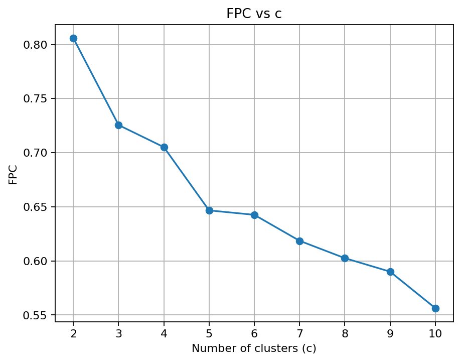
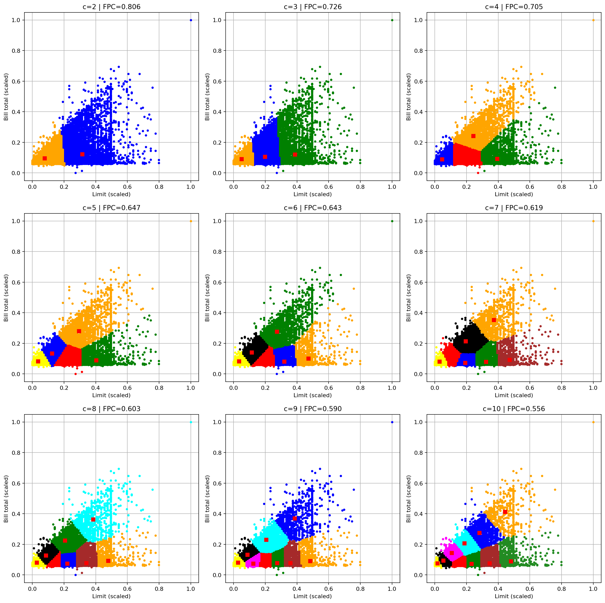
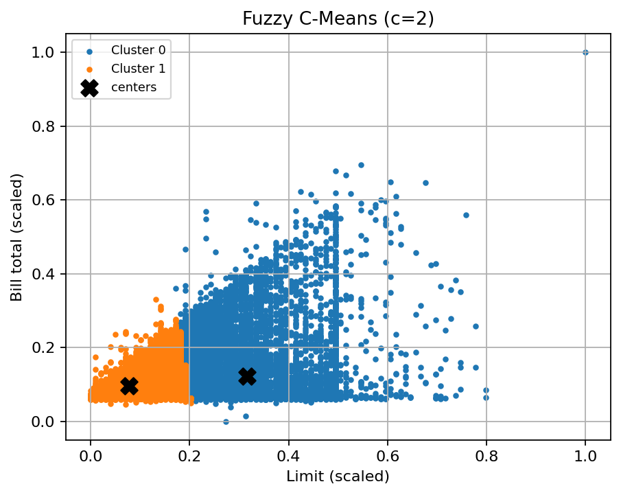

# Fuzzy C-Means (C-Means)

This project applies **Fuzzy C-Means (FCM)** clustering (via `scikit-fuzzy`) to the *Default of Credit Card Clients* dataset using two features:

- `LIMIT_BAL` — credit limit  
- `BILL TOTAL` — `BILL_AMT1+…+BILL_AMT6`

The pipeline:

1. Load `data/credit_card_clients.csv` (your exact path).  
2. Create `BILL TOTAL`.  
3. Scale `['LIMIT_BAL', 'BILL TOTAL']` to `[0,1]`.  
4. Run FCM for a sweep of cluster counts (`c = 2..10`).  
5. Plot FPC vs `c` and a grid of mini-scatter plots.  
6. Pick the `c` with the **highest FPC** and plot the final clustering.

---

## What is Fuzzy C-Means?

FCM finds \(c\) centers \(v_i\) and a **membership matrix** \(U=[u_{ik}]\) where each sample \(x_k\) has *soft* memberships:

- \(u_{ik}\in[0,1]\), and \(\sum_{i=1}^c u_{ik}=1\) for each \(k\).

### Objective (Bezdek)

Minimize the fuzzy within-cluster sum of squares:

\[
J_m(U,V)=\sum_{i=1}^{c}\sum_{k=1}^{n} u_{ik}^{\,m}\,\lVert x_k - v_i\rVert^2,
\]

with fuzzifier \(m>1\) (typical \(1.6\!-\!2.0\)). Larger \(m\) ⇒ softer memberships.

### Alternating updates (Euclidean)

Centers:
\[
v_i=\frac{\sum_{k} u_{ik}^{\,m} x_k}{\sum_{k} u_{ik}^{\,m}}
\]

Memberships:
\[
u_{ik}=\left(\sum_{j=1}^{c}\left(\frac{\lVert x_k-v_i\rVert}{\lVert x_k-v_j\rVert}\right)^{\frac{2}{m-1}}\right)^{-1}
\]

Stop when \(\lVert U^{(t)}-U^{(t-1)}\rVert_\infty<\texttt{error}\) or \(\texttt{maxiter}\) is reached.

---

## Choosing the number of clusters

We report the **Fuzzy Partition Coefficient (FPC)** for each \(c\):

\[
\mathrm{FPC}=\frac{1}{n}\sum_{k=1}^{n}\sum_{i=1}^{c} u_{ik}^{\,2}.
\]

Higher is better. Values near \(1/c\) indicate very fuzzy/overlapping partitions.

> In this 2-feature run, FPC peaks at \(c=2\), then decreases as \(c\) grows.

---

## Results (your plots)

> These image paths assume you ran `main.py` and the script wrote plots to `docs/`.

### 1) FPC vs number of clusters

**How to read:**  
- The curve shows FPC for `c = 2..10`.  
- **Pick the peak** (here it’s at `c = 2`).  
- The downward slope after `c=2` means adding more clusters makes the partition fuzzier (less crisp separation) for these two features.

---

### 2) Cluster grids (c = 2…10)

**What you’re seeing:**  
- Each panel is an FCM run for a specific `c`.  
- Colors = hard labels from the fuzzy memberships (`argmax` across clusters).  
- Black/red squares = cluster centers (in **scaled** space).  
- As `c` increases, the algorithm keeps subdividing the dense region at low limit / low bill totals.  
- FPC shown in each title steadily **declines** with `c`, indicating the split becomes less crisp.

**Takeaway:** For these two features, **few clusters** (especially `c=2`) summarize the structure best. Large `c` just slices the same mass in arbitrary ways.

---

### 3) Final clustering (chosen c by FPC)

**Interpretation:**  
- Two broad groups appear in scaled space:  
  1) smaller limits & small bills;  
  2) higher limits & larger bills.  
- The **“X” markers** are the fuzzy centers.  
- Remember: points near the boundary have **non-trivial memberships in both clusters**; colors show the *hard* label for visualization only.

---

## Practical tips

- **Always scale** features before FCM (Euclidean metric).  
- If you switch to more features, avoid heavy **collinearity** (or use a compact subset).  
- If you ever get FPC ≈ `1/c` across all `c`, that’s a **degenerate** run (uniform memberships). Rerun with different initializations or adjust features/scale.  
- Soft memberships are great for: thresholding borderline points, ranking “how typical” a point is for a cluster, and flagging outliers (low max-membership).

---
